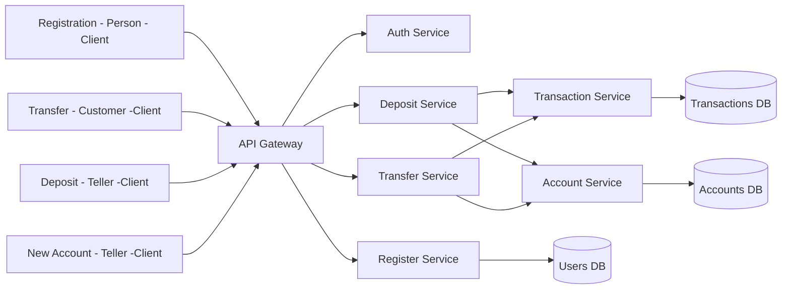

Here is the proposed architecture for the project:

```mermaid
graph LR
    %% Clients
    Client1[Registration - Person - Client]
    Client2[Transfer - Customer -Client]
    Client3[Deposit - Teller -Client]
    Client4[New Account - Teller -Client]

    %% Gateway
    Gateway[API Gateway]

    %% Services
    Auth[Auth Service]
    Deposit[Deposit Service]
    Transfer[Transfer Service]
    Reg[Register Service]
    
    %% Secondary Services
    Transaction[Transaction Service]
    Account[Account Service]

    %% Databases
    DB_Trans[(Transactions DB)]
    DB_Acc[(Accounts DB)]
    DB_Users[(Users DB)]

    %% Connections: Clients to Gateway
    Client1 --> Gateway
    Client2 --> Gateway
    Client3 --> Gateway
    Client4 --> Gateway

    %% Connections: Gateway to Services
    Gateway --> Auth
    Gateway --> Deposit
    Gateway --> Transfer
    Gateway --> Reg

    %% Connections: Services Logic
    Deposit --> Transaction
    Deposit --> Account
    
    Transfer --> Transaction
    Transfer --> Account

    %% Connections: Services to Databases
    Transaction --> DB_Trans
    Account --> DB_Acc
    Reg --> DB_Users
```