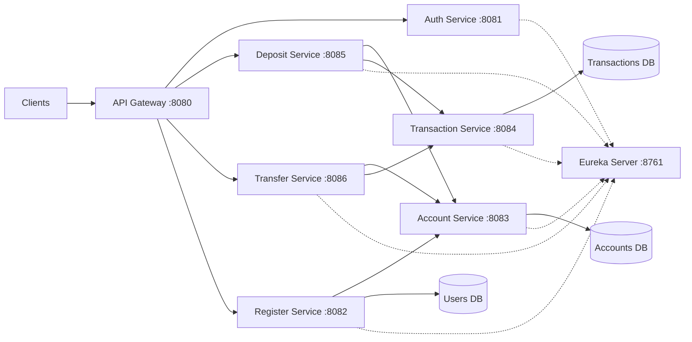

# Banking System - Microservices Architecture

A Spring Boot microservices-based banking system implementing account management, deposits, transfers, and user authentication.

## 🏗️ Architecture Overview

```
Client → API Gateway → Microservices → Databases
         (Port 8080)   (Eureka Discovery)
```

### Services

| Service | Port | Description | Database |
|---------|------|-------------|----------|
| **Eureka Server** | 8761 | Service Discovery | - |
| **API Gateway** | 8080 | Single Entry Point | - |
| **Auth Service** | 8081 | JWT Authentication | - |
| **Register Service** | 8082 | User Registration | Users DB (H2) |
| **Account Service** | 8083 | Account Management | Accounts DB (H2) |
| **Transaction Service** | 8084 | Transaction History | Transactions DB (H2) |
| **Deposit Service** | 8085 | Deposit Orchestrator | - |
| **Transfer Service** | 8086 | Transfer Orchestrator | - |

### Architecture Diagram



## 🚀 Quick Start

### Prerequisites

**Option 1: Docker (Recommended)**
- Docker 20.10+
- Docker Compose 2.0+

**Option 2: Manual Setup**
- Java 17 or higher
- Maven 3.6+
- Git

### Run with Docker (Recommended)

The easiest way to run all services at once:

```bash
# Clone the repository
git clone <repository-url>
cd app-design-backend

# Build and start all services
docker compose up -d

# View logs
docker compose logs -f

# Stop all services
docker compose down
```

Or use the helper scripts:

```bash
# Build Docker images
./docker-build.sh

# Start all services
./docker-start.sh

# Stop all services
./docker-stop.sh
```

Services will be available at:
- Eureka Server: http://localhost:8761
- API Gateway: http://localhost:8080
- All other services accessible through the gateway

### Manual Setup (Alternative)

#### Build the Project

```bash
# Clone the repository
git clone <repository-url>
cd app-design-backend

# Build all modules
mvn clean install
```

#### Run Services

Start services in this order:

1. **Eureka Server** (Service Discovery)
```bash
cd eureka-server
mvn spring-boot:run
# Wait for startup, then access: http://localhost:8761
```

2. **API Gateway**
```bash
cd api-gateway
mvn spring-boot:run
```

3. **Data Services** (can run in parallel)
```bash
# Terminal 1
cd account-service
mvn spring-boot:run

# Terminal 2
cd transaction-service
mvn spring-boot:run

# Terminal 3
cd register-service
mvn spring-boot:run
```

4. **Orchestrator Services** (can run in parallel)
```bash
# Terminal 4
cd auth-service
mvn spring-boot:run

# Terminal 5
cd deposit-service
mvn spring-boot:run

# Terminal 6
cd transfer-service
mvn spring-boot:run
```

## 📚 API Documentation (Swagger/OpenAPI)

The project includes comprehensive Swagger/OpenAPI documentation for all services.

### Access Swagger UI

**Through API Gateway (Recommended):**
- **Aggregated Documentation**: http://localhost:8080/swagger-ui.html
  - View all services' APIs in one place
  - Switch between services using the dropdown menu

**Individual Services:**
Each service has its own Swagger UI accessible directly:

| Service | Swagger UI URL | API Docs JSON |
|---------|---------------|---------------|
| **Auth Service** | http://localhost:8081/swagger-ui.html | http://localhost:8081/v3/api-docs |
| **Register Service** | http://localhost:8082/swagger-ui.html | http://localhost:8082/v3/api-docs |
| **Account Service** | http://localhost:8083/swagger-ui.html | http://localhost:8083/v3/api-docs |
| **Transaction Service** | http://localhost:8084/swagger-ui.html | http://localhost:8084/v3/api-docs |
| **Deposit Service** | http://localhost:8085/swagger-ui.html | http://localhost:8085/v3/api-docs |
| **Transfer Service** | http://localhost:8086/swagger-ui.html | http://localhost:8086/v3/api-docs |

### Using Swagger UI

1. **Explore APIs**: Browse all available endpoints with detailed descriptions
2. **Try It Out**: Execute API calls directly from the browser
3. **Authentication**: For protected endpoints:
   - First, call `POST /api/auth/login` to get a JWT token
   - Click the "Authorize" button (🔓) at the top of Swagger UI
   - Enter: `Bearer <your-jwt-token>`
   - Click "Authorize" and "Close"
   - Now you can test protected endpoints

### API Documentation Features

- **Request/Response Schemas**: Detailed data models with examples
- **Parameter Descriptions**: Clear explanations of all parameters
- **Response Codes**: HTTP status codes with descriptions
- **Security Schemes**: JWT Bearer token authentication documented
- **Try It Out**: Interactive API testing directly from the browser

## 📋 API Endpoints

All requests go through the API Gateway at `http://localhost:8080`

### Authentication

```bash
# Register a new user
POST http://localhost:8080/api/register
Content-Type: application/json

{
  "username": "john_doe",
  "email": "john@example.com",
  "password": "password123",
  "role": "CUSTOMER"
}

# Login
POST http://localhost:8080/api/auth/login
Content-Type: application/json

{
  "username": "john_doe",
  "password": "password123"
}
```

### Account Management

```bash
# Get account by ID
GET http://localhost:8080/api/accounts/{accountId}
Authorization: Bearer <jwt-token>

# Get accounts by user ID
GET http://localhost:8080/api/accounts/user/{userId}
Authorization: Bearer <jwt-token>
```

### Deposit

```bash
# Make a deposit
POST http://localhost:8080/api/deposit
Authorization: Bearer <jwt-token>
Content-Type: application/json

{
  "accountId": 1,
  "amount": 1000.00,
  "tellerId": 1
}
```

### Transfer

```bash
# Transfer between accounts
POST http://localhost:8080/api/transfer
Authorization: Bearer <jwt-token>
Content-Type: application/json

{
  "fromAccountId": 1,
  "toAccountId": 2,
  "amount": 500.00
}
```

### Transaction History

```bash
# Get transactions for an account
GET http://localhost:8080/api/transactions/account/{accountId}
Authorization: Bearer <jwt-token>
```

## 🛠️ Technology Stack

- **Framework**: Spring Boot 3.2.0
- **Cloud**: Spring Cloud 2023.0.0
- **Service Discovery**: Netflix Eureka
- **API Gateway**: Spring Cloud Gateway
- **Inter-service Communication**: OpenFeign
- **Monitoring**: Spring Boot Actuator
- **Database**: H2 (in-memory)
- **Security**: JWT (JSON Web Tokens)
- **API Documentation**: Springdoc OpenAPI 3 (Swagger UI)
- **Build Tool**: Maven (Multi-Module)
- **Java Version**: 17
- **Containerization**: Docker & Docker Compose

## 📁 Project Structure

```
app-design-backend/
├── pom.xml                      # Parent POM
├── eureka-server/               # Service Discovery
├── api-gateway/                 # API Gateway & Routing
├── auth-service/                # Authentication & JWT
├── register-service/            # User Registration
│   └── src/main/resources/
│       └── application.yml      # H2: usersdb
├── account-service/             # Account Management
│   └── src/main/resources/
│       └── application.yml      # H2: accountsdb
├── transaction-service/         # Transaction History
│   └── src/main/resources/
│       └── application.yml      # H2: transactionsdb
├── deposit-service/             # Deposit Orchestration
└── transfer-service/            # Transfer Orchestration
```

## 🔧 Configuration

### Service Discovery

All services register with Eureka Server at `http://localhost:8761/eureka/`

### Database

Each data service uses its own H2 in-memory database:
- **Register Service**: `jdbc:h2:mem:usersdb`
- **Account Service**: `jdbc:h2:mem:accountsdb`
- **Transaction Service**: `jdbc:h2:mem:transactionsdb`

H2 Console available at: `http://localhost:<service-port>/h2-console`

### JWT Configuration

JWT secret key is configured in `auth-service/src/main/resources/application.yml`
- Token expiration: 24 hours (86400000 ms)

## 🧪 Testing

### Health Checks

All services expose Spring Boot Actuator endpoints for health monitoring:

#### Check Through API Gateway

You can check service health through the API Gateway (recommended):

```bash
# Check API Gateway health and info
curl http://localhost:8080/actuator/health
curl http://localhost:8080/actuator/info
curl http://localhost:8080/actuator/metrics

```

#### Check Services Directly

Alternatively, check services directly on their ports:

```bash
# Check if all services are registered
curl http://localhost:8761/

# Check individual service health directly
curl http://localhost:8761/actuator/health  # Eureka Server
curl http://localhost:8081/actuator/health  # Auth Service
curl http://localhost:8082/actuator/health  # Register Service
curl http://localhost:8083/actuator/health  # Account Service
curl http://localhost:8084/actuator/health  # Transaction Service
curl http://localhost:8085/actuator/health  # Deposit Service
curl http://localhost:8086/actuator/health  # Transfer Service
```

### Available Actuator Endpoints

Each service exposes:
- `/actuator/health` - Service health status with detailed components
- `/actuator/info` - Service information
- `/actuator/metrics` - Service metrics

### Test Flow

1. Register a user
2. Login to get JWT token
3. Use token to access protected endpoints
4. Make deposits and transfers
5. View transaction history

## 📝 Development Notes

### Design Decisions

- **Synchronous REST Communication**: Easier to implement and debug within 48-hour constraint
- **H2 In-Memory Database**: Fast development without external database setup
- **No Distributed Transactions**: Simple sequential calls instead of Saga pattern
- **JWT without Refresh Tokens**: Simplified authentication flow
- **Service Naming**: Lowercase names for consistency (e.g., `auth-service`)

### Common Issues

1. **Service not registering with Eureka**: Wait 30-60 seconds for registration
2. **Port conflicts**: Ensure no other services are using ports 8080-8086, 8761
3. **Maven build fails**: Run `mvn clean install` from root directory
4. **Gateway routing issues**: Verify service names match `spring.application.name`

## 🐳 Docker Details

### Container Architecture

All services run in separate containers connected via `banking-network`:
- **Health Checks**: Eureka Server has health checks to ensure it's ready
- **Service Dependencies**: Services wait for Eureka before starting
- **Restart Policy**: Services automatically restart on failure
- **Networking**: Bridge network for inter-service communication

### Docker Commands

```bash
# Build specific service
docker compose build eureka-server

# View logs for specific service
docker compose logs -f api-gateway

# Restart specific service
docker compose restart account-service

# Remove all containers and networks
docker compose down

# Remove containers, networks, and volumes
docker compose down -v
```

## 🎯 Future Enhancements

- [x] Docker Compose for easy deployment
- [x] Swagger/OpenAPI documentation
- [ ] Unit tests
