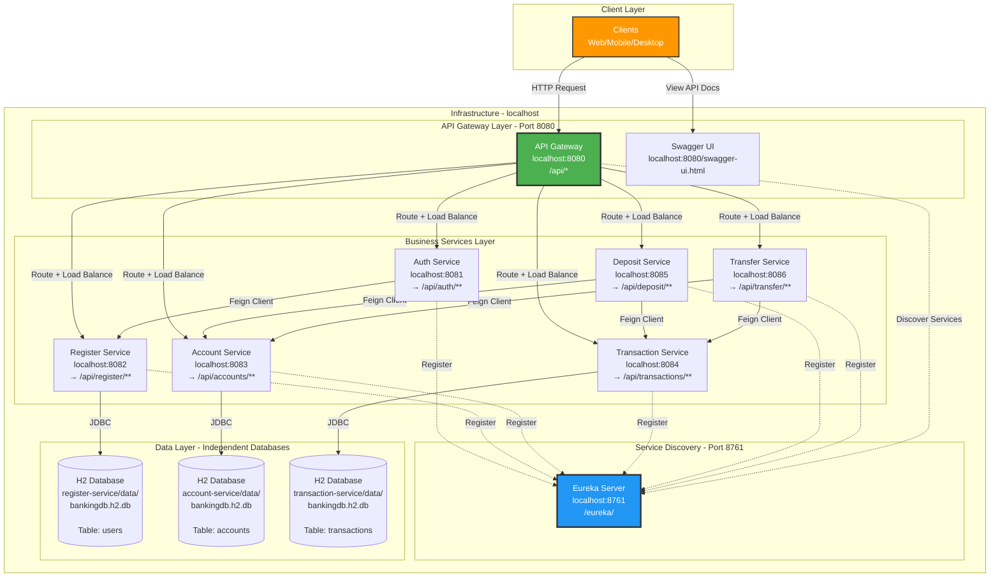
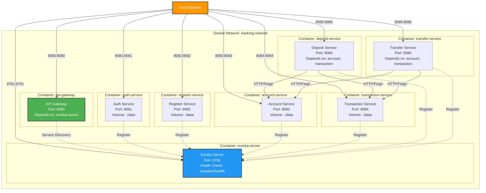
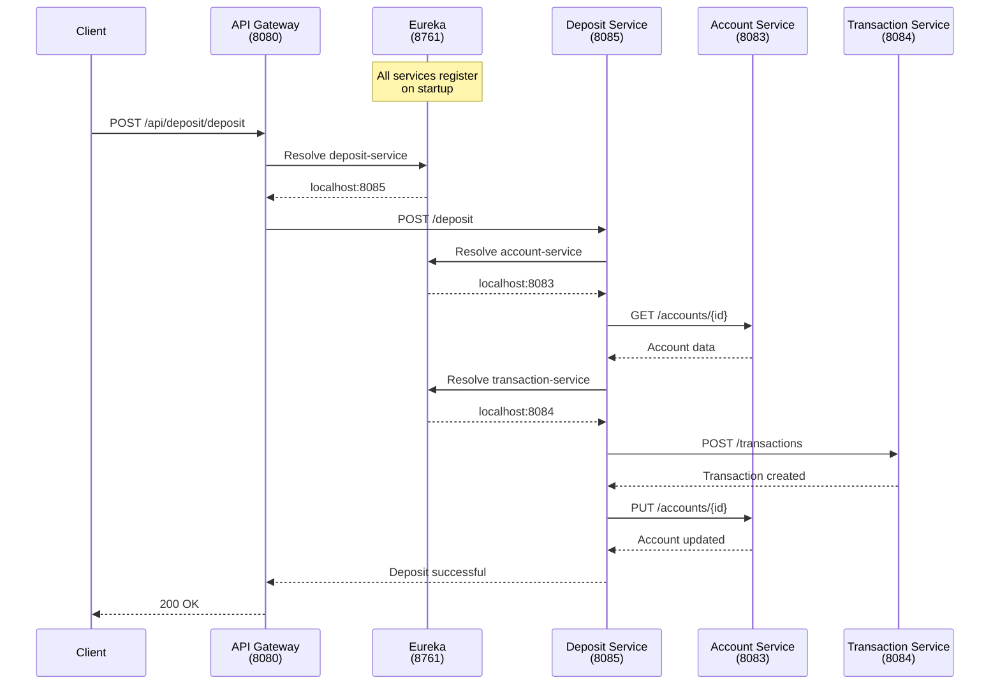

# Deployment Diagram

## Service Deployment Architecture



## Port Allocation Table

| Service | Port | Address | Purpose | External Access |
|---------|------|---------|---------|-----------------|
| **Eureka Server** | 8761 | `http://localhost:8761` | Service Discovery | Yes - Dashboard |
| **API Gateway** | 8080 | `http://localhost:8080` | Entry Point for all APIs | Yes - Main Entry |
| **Auth Service** | 8081 | `http://localhost:8081` | Authentication & JWT | Via Gateway |
| **Register Service** | 8082 | `http://localhost:8082` | User Registration | Via Gateway |
| **Account Service** | 8083 | `http://localhost:8083` | Account Management | Via Gateway |
| **Transaction Service** | 8084 | `http://localhost:8084` | Transaction Records | Via Gateway |
| **Deposit Service** | 8085 | `http://localhost:8085` | Deposit Operations | Via Gateway |
| **Transfer Service** | 8086 | `http://localhost:8086` | Transfer Operations | Via Gateway |

## API Gateway Route Mapping

| External Path | Internal Service | Internal Path | Port |
|--------------|------------------|---------------|------|
| `/api/auth/**` | auth-service | `/auth/**` → `/**` | 8081 |
| `/api/register/**` | register-service | `/register/**` → `/**` | 8082 |
| `/api/accounts/**` | account-service | `/accounts/**` → `/**` | 8083 |
| `/api/transactions/**` | transaction-service | `/transactions/**` → `/**` | 8084 |
| `/api/deposit/**` | deposit-service | `/deposit/**` → `/**` | 8085 |
| `/api/transfer/**` | transfer-service | `/transfer/**` → `/**` | 8086 |

## Service Endpoints

### Client Entry Points

- **Main API Gateway**: `http://localhost:8080`
- **Swagger UI (All Services)**: `http://localhost:8080/swagger-ui.html`
- **Eureka Dashboard**: `http://localhost:8761`

### Service-Specific Swagger Docs (via Gateway)

- Auth Service: `http://localhost:8080/api/auth/v3/api-docs`
- Register Service: `http://localhost:8080/api/register/v3/api-docs`
- Account Service: `http://localhost:8080/api/accounts/v3/api-docs`
- Transaction Service: `http://localhost:8080/api/transactions/v3/api-docs`
- Deposit Service: `http://localhost:8080/api/deposit/v3/api-docs`
- Transfer Service: `http://localhost:8080/api/transfer/v3/api-docs`

## Docker Deployment Architecture



## Database Storage Locations

| Service | Database Type | Storage Path | Database File | Table(s) |
|---------|--------------|--------------|---------------|----------|
| Auth Service | Stateless | N/A | N/A | Uses Feign to call Register Service |
| Register Service | H2 (File) | `./register-service/data/` | `bankingdb.h2.db` | `users` |
| Account Service | H2 (File) | `./account-service/data/` | `bankingdb.h2.db` | `accounts` |
| Transaction Service | H2 (File) | `./transaction-service/data/` | `bankingdb.h2.db` | `transactions` |
| Deposit Service | Stateless | N/A | N/A | Uses Feign to access Account/Transaction |
| Transfer Service | Stateless | N/A | N/A | Uses Feign to access Account/Transaction |

**Note**: Only Register, Account, and Transaction services have databases. Each has its own separate H2 database file at `./data/bankingdb.h2.db` relative to the service's working directory. Auth, Deposit, and Transfer services are stateless and access data via Feign clients.

## Service Communication Patterns



## Health Check Endpoints

All services expose health check endpoints via Spring Boot Actuator:

- Eureka Server: `http://localhost:8761/actuator/health`
- API Gateway: `http://localhost:8080/actuator/health`
- Auth Service: `http://localhost:8081/actuator/health`
- Register Service: `http://localhost:8082/actuator/health`
- Account Service: `http://localhost:8083/actuator/health`
- Transaction Service: `http://localhost:8084/actuator/health`
- Deposit Service: `http://localhost:8085/actuator/health`
- Transfer Service: `http://localhost:8086/actuator/health`

## Environment Configuration

### Local Development
- All services run on localhost
- H2 databases in file mode (./data/)
- H2 Console enabled for debugging
- Eureka self-preservation disabled

### Docker Deployment
- Services communicate via `banking-network` bridge network
- Container-to-container communication uses service names
- Port mapping from container to host (e.g., 8080:8080)
- Eureka URL: `http://eureka-server:8761/eureka/`
- Health checks with retry logic

## Deployment Commands

### Local Development
```bash
# Start all services
./run.sh

# Stop all services
./stop.sh

# Check service status
./status.sh
```

### Docker Deployment
```bash
# Build all services
./docker-build.sh

# Start containers
./docker-start.sh

# Stop containers
./docker-stop.sh

# Or use docker-compose directly
docker-compose up -d
docker-compose down
```

## Network Flow Summary

1. **Client → API Gateway (8080)**: Single entry point for all requests
2. **API Gateway → Eureka (8761)**: Service discovery and load balancing
3. **API Gateway → Services (8081-8086)**: Routed requests with prefix stripping
4. **Services → Eureka (8761)**: Service registration and heartbeat
5. **Business Services → Core Services**: Inter-service communication via Feign
   - Deposit Service → Account Service (8083)
   - Deposit Service → Transaction Service (8084)
   - Transfer Service → Account Service (8083)
   - Transfer Service → Transaction Service (8084)
6. **Services → H2 Databases**: JDBC connections to file-based databases
