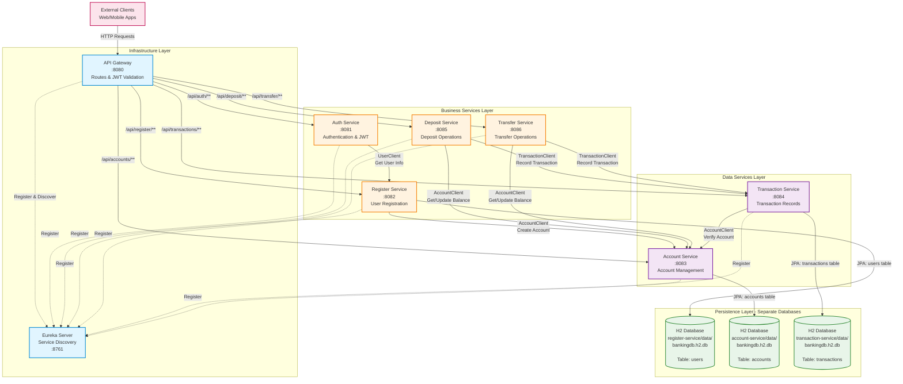
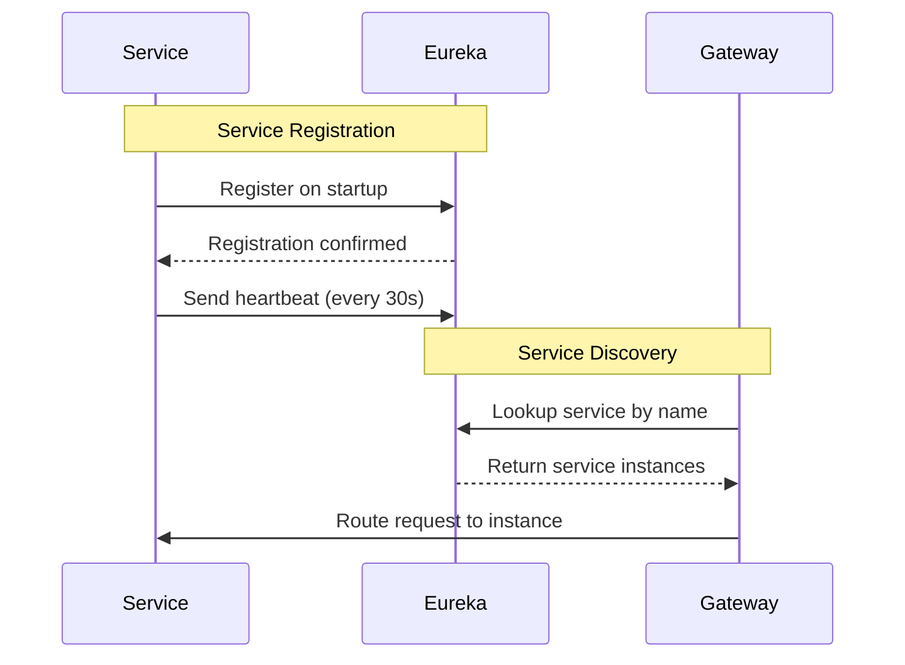
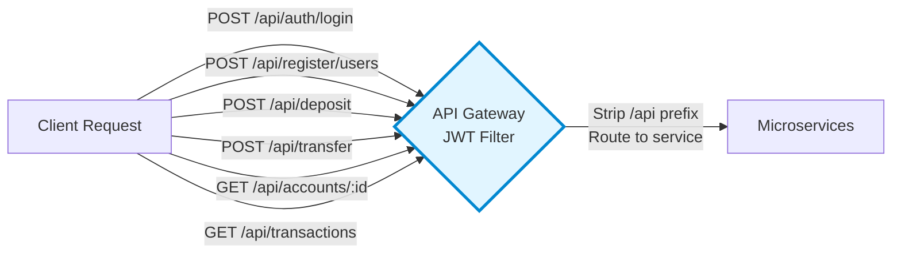
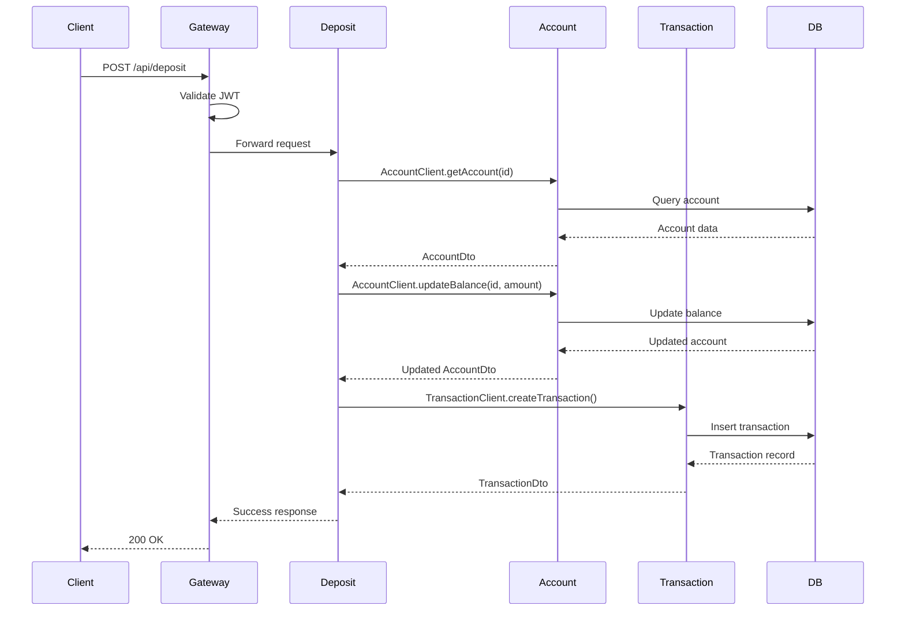
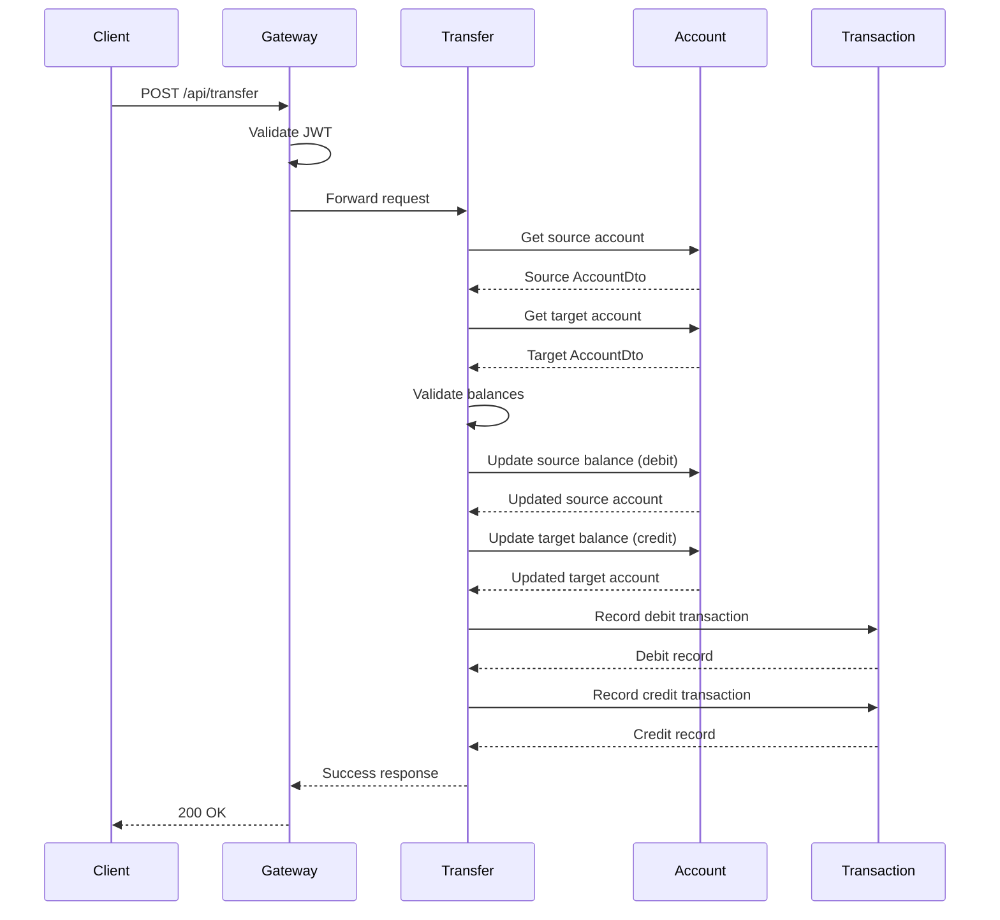
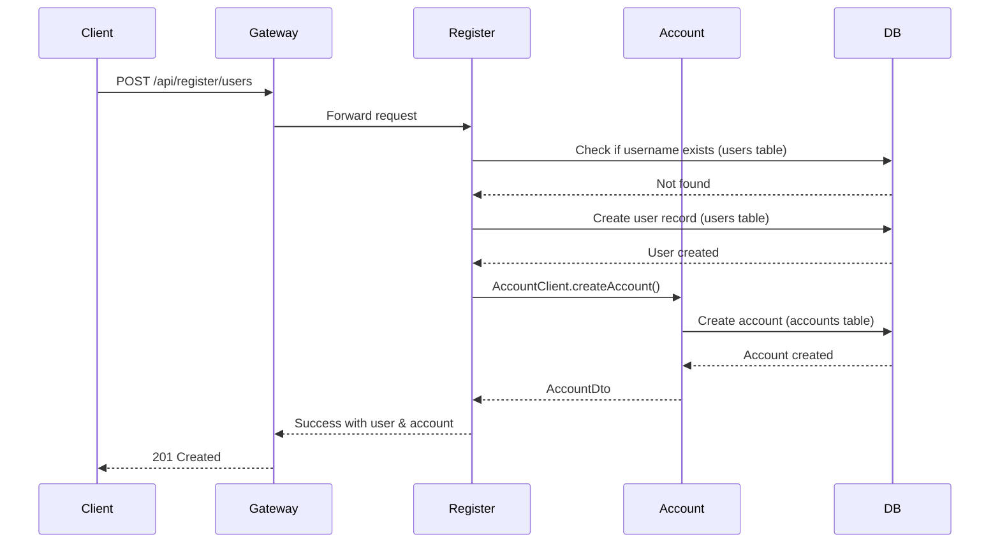
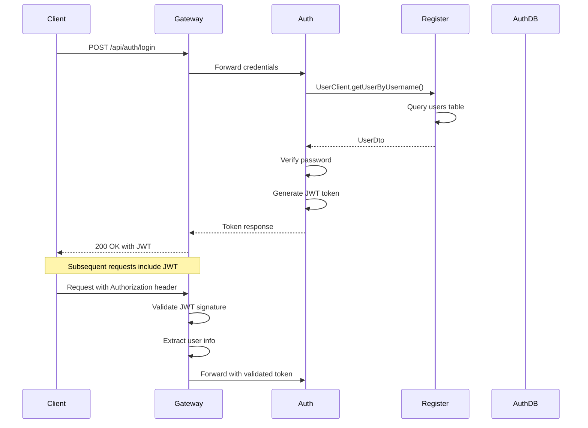

# Microservices Architecture Diagram

## Complete System Architecture

This diagram shows how all services in the banking system are wired together, including service discovery, API gateway routing, inter-service communication via Feign clients, and database dependencies.

## Service Communication Patterns

### 1. Service Discovery Pattern

### 2. API Gateway Routing Pattern

### 3. Deposit Flow

### 4. Transfer Flow

### 5. User Registration Flow

### 6. Authentication Flow

## Technology Stack

### Communication Patterns
- **Service Discovery**: Netflix Eureka
- **API Gateway**: Spring Cloud Gateway with JWT filter
- **Inter-Service Communication**: OpenFeign clients (synchronous REST)
- **Load Balancing**: Client-side load balancing via Eureka

### Data Management
- **Database**: Data services have their own H2 file-based database at `./data/bankingdb.h2.db` (relative to service directory)
- **Database per Service**: 
  - `register-service/data/bankingdb.h2.db` - Table: `users` (user profiles & credentials)
  - `account-service/data/bankingdb.h2.db` - Table: `accounts`
  - `transaction-service/data/bankingdb.h2.db` - Table: `transactions`
- **Stateless Services**: Auth, Deposit, and Transfer services have no database - they use Feign clients to access data
- **ORM**: Spring Data JPA / Hibernate
- **Transaction Management**: Local transactions per service

### Key Design Decisions
1. **Database per Service**: Each service has its own isolated H2 database
   - Follows microservices principle of data autonomy
   - Each service owns its data and schema
   - Services communicate via Feign clients, never direct DB access
2. **Synchronous Communication**: Using Feign for simplicity in short time constraint
3. **Stateless Services**: JWT tokens for authentication, no session management
4. **API Gateway Pattern**: Single entry point with routing and security
5. **Service Registry**: Centralized service discovery with Eureka

## Port Mapping

| Service | Port | Purpose |
|---------|------|---------|
| Eureka Server | 8761 | Service discovery and registry |
| API Gateway | 8080 | External-facing API endpoint |
| Auth Service | 8081 | Authentication and JWT generation |
| Register Service | 8082 | User registration |
| Account Service | 8083 | Account management |
| Transaction Service | 8084 | Transaction records |
| Deposit Service | 8085 | Deposit operations |
| Transfer Service | 8086 | Transfer operations |

## API Gateway Routes

All external requests go through the gateway at `http://localhost:8080`:

- `/api/auth/**` → Auth Service
- `/api/register/**` → Register Service  
- `/api/accounts/**` → Account Service
- `/api/transactions/**` → Transaction Service
- `/api/deposit/**` → Deposit Service
- `/api/transfer/**` → Transfer Service

The gateway strips the `/api` prefix before routing to services.
